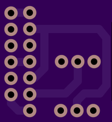

# Digispark breakout

A digispark breakout primarily aimed at 3 pin "arduino" modules. I use it with
relay boards, DHT11 / DHT22 temperature / humidity sensors, and hall effect sensors.

Shared on [OSH Park.](https://oshpark.com/shared_projects/2PvuLxGp)

 

## Design notes

* Exposes two D/A pins (P5 and P2) and one PWM pin (P0), P3 and P4 are not
exposed as this is designed to primarily be used with
[Littlewire](https://github.com/littlewire/Little-Wire) over USB. 
* The center five pins are designed to allow three pin modules with any permutation of pins.
* V+ on the header is selectable via a jumper between Vin and 5V from the
regulator.
